# SPRING WEB APP

export PATH=/Users/pc/Documents/PROYECTOS-PAUL/CODIGO/JAVA/MAVEN/apache-maven-3.5.2/bin:$PATH


## INCLUIR LIBRERIAS POR MAVEN
1. Click derecho en el proyecto>Configure>Conver to Maven Project
2. Activar las opciones de maven en la ventana de Eclipse>Preferences>Maven y activar las opciones de la imagen.
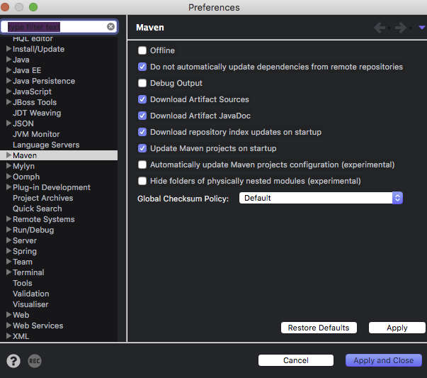
3. Reiniciar el IDE y esperar a que se bajen el diccionario de paquetes de maven.
4. Ir al archivo pom.xml> Pestania dependecies> Boton Add> Buscar la libreria que se requiera> Seleccionar Libreria> Dar Click en OK
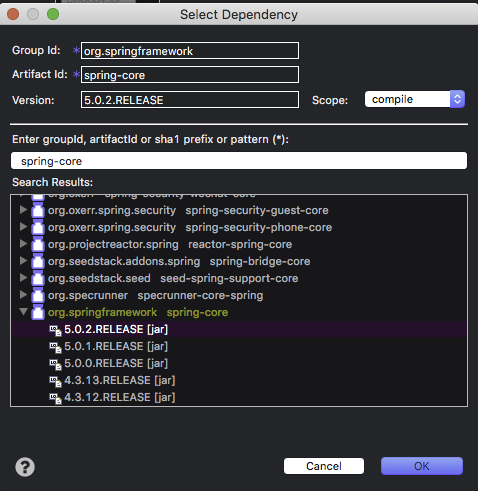

## LIBRERIAS
### LIBRERIAS SPRING	
* spring-core	
* spring-beans
* spring-context 
* spring-web
* spring-webmvc
* spring-aop
* spring-expression

**Archivo**: *./pom.xml*, `seccion de dependecies`
````xml
<dependencies>
  	<dependency>
  		<groupId>org.springframework</groupId>
  		<artifactId>spring-core</artifactId>
  		<version>5.0.2.RELEASE</version>
  	</dependency>
  	<dependency>
  		<groupId>org.springframework</groupId>
  		<artifactId>spring-beans</artifactId>
  		<version>5.0.2.RELEASE</version>
  	</dependency>
  	<dependency>
  		<groupId>org.springframework</groupId>
  		<artifactId>spring-context</artifactId>
  		<version>5.0.2.RELEASE</version>
  	</dependency>
  	<dependency>
  		<groupId>org.springframework</groupId>
  		<artifactId>spring-web</artifactId>
  		<version>5.0.2.RELEASE</version>
  	</dependency>
  	<dependency>
  		<groupId>org.springframework</groupId>
  		<artifactId>spring-webmvc</artifactId>
  		<version>5.0.2.RELEASE</version>
  	</dependency>
  	<dependency>
  		<groupId>org.springframework</groupId>
  		<artifactId>spring-aop</artifactId>
  		<version>5.0.2.RELEASE</version>
  	</dependency>
  	<dependency>
  		<groupId>org.springframework</groupId>
  		<artifactId>spring-expression</artifactId>
  		<version>5.0.2.RELEASE</version>
  	</dependency>
  	<dependency>
  		<groupId>javax.servlet</groupId>
  		<artifactId>servlet-api</artifactId>
  		<version>2.5</version>
  	</dependency>
  </dependencies>
````

### LIBRERIA PARA WILDFLY
En el caso de que exista el error:
> the superclass "javax.servlet.http.HttpServlet" was not found on the Java Build Path

`Debemos importar la libreria de javax.servlet.`
+ servlet-api

## DISPACHER
Es la piedra angular, la cual maneja las peticiones http.
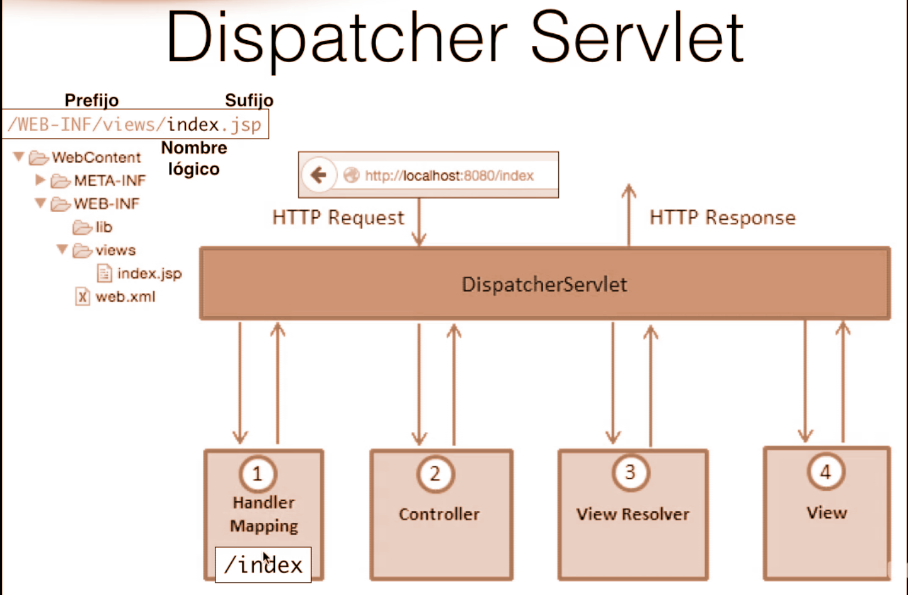

### CREACION DEL DISPACHER SERVLET
1. New>servlet>
2. Click en la opcion `Use an exist servlet class or JSP` y seleccionar la opcion dispacher de org.spring
> Si aparece el error `Cannot add existing servlet in Eclipse` asegurate que las dependencias declaradas en maven se hayan descargado o reinicia el IDE.
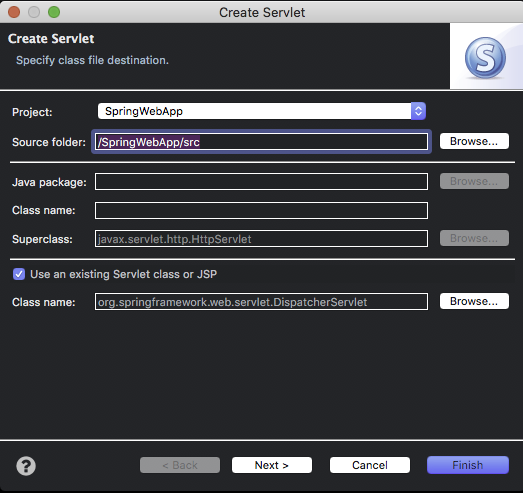
3. Poner el nombre de `dispacher` y fijar en url mapping la ruta `/`
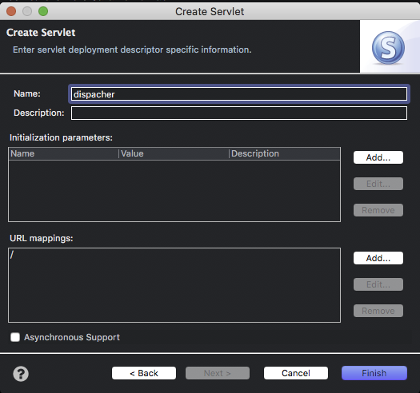
4. Dar click en finish.

> El codigo que se genera a travez de esta configuracion es la siguiente


**Archivo**: */WebContent/WEB-INF/web.xml*
````xml
<servlet>
    <description></description>
    <display-name>dispacher</display-name>
    <servlet-name>dispacher</servlet-name>
    <servlet-class>org.springframework.web.servlet.DispatcherServlet</servlet-class>
  </servlet>
  <servlet-mapping>
    <servlet-name>dispacher</servlet-name>
    <url-pattern>/</url-pattern>
  </servlet-mapping>
````
## BEAN DEL VIEW RESOLVER

### CREACION DEL SPRING BEAN CONFIGURATION FILE

1. Click derecho carpeta *./Webcontent/WEB-INF*> New > Others > seleccionar en la ventana `Spring Bean Configuration File`> Next
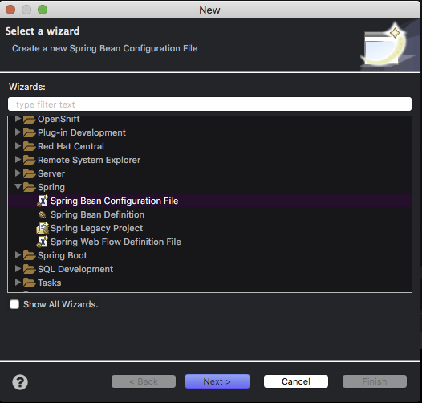

2. Colocar en el file name el mismo nombre que usamos en la creacion del dispacher mas el sufijo `-servlet`
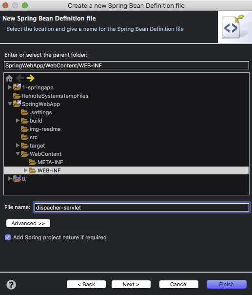

**Archivo**: */WebContent/WEB-INF/dispacher-servlet.xml*
````xml
<?xml version="1.0" encoding="UTF-8"?>
<beans xmlns="http://www.springframework.org/schema/beans"
	xmlns:xsi="http://www.w3.org/2001/XMLSchema-instance"
	xsi:schemaLocation="http://www.springframework.org/schema/beans http://www.springframework.org/schema/beans/spring-beans.xsd">
</beans>
````

### CONFIGURACION DEL VIEW RESOLVER
1. Seleccionar archivo `./WebContent/WEB-INF/dispacher-servlet.xml`> Click en la pestania Beans> New Bean > Colocar en id `jspViewResolver` y en class `InternalResource`> click en browse y seleccionar `InternalResourceViewResolver`> next
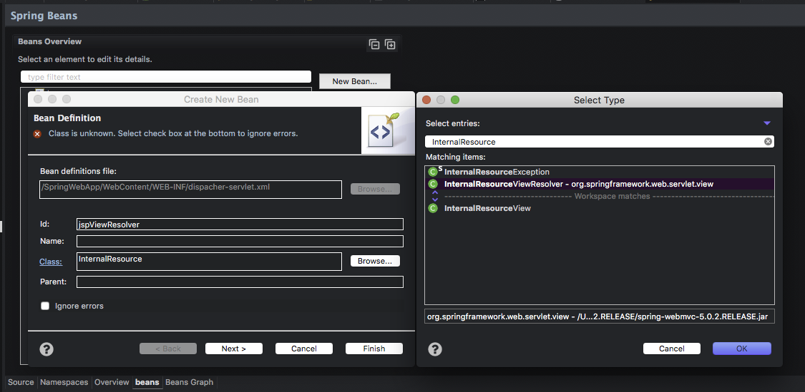
2. Anadir las propiedad suffix:`WEB-INF/views/` y prefix:`.jsp`
* Anadir propiedad
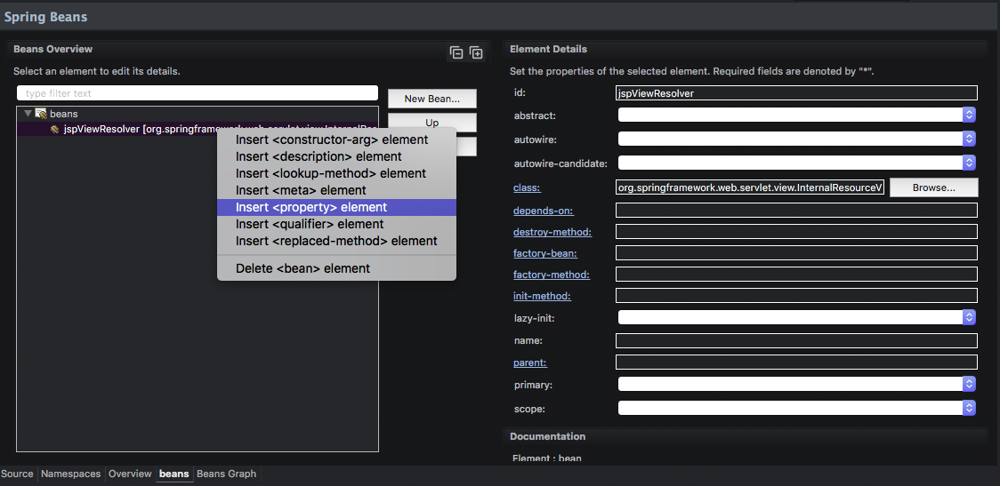
* Propiedades creadas


**Archivo**: */WebContent/WEB-INF/dispacher-servlet.xml*
````xml
<bean id="jspViewResolver" class="org.springframework.web.servlet.view.InternalResourceViewResolver">	
		<property name="prefix" value="WEB-INF/views/"></property>
		<property name="suffix" value=".jsp "></property>
</bean>
````
### CONFIGURACION DEL SCANEO AUTOMATICO DE LOS CONTROLADORES
1. Crear un paquete donde se localizaran los controladores.
2. Seleccionar archivo `./WebContent/WEB-INF/dispacher-servlet.xml`> Click en la pestania Nemespaces> dar click en `context`
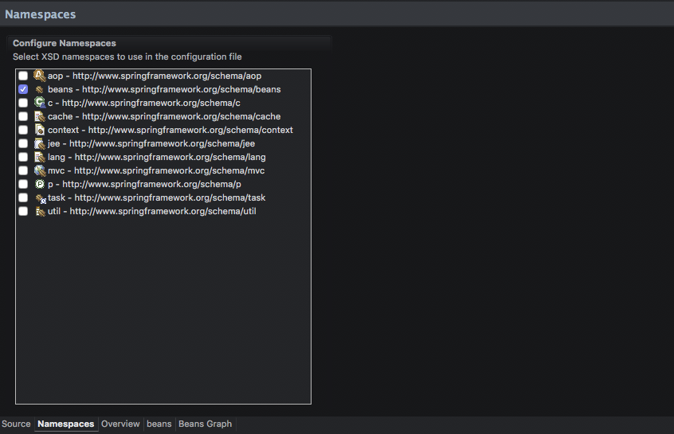
3. Seleccionar la pestania context > Click derecho en beans > click en context:component:scan
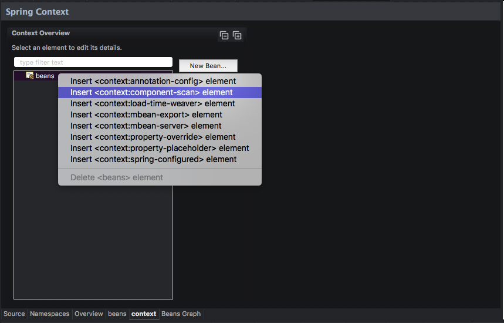
4. Seleccionar `componen-scan` y en base-package apuntar al paquete donde se localizaran los controladores
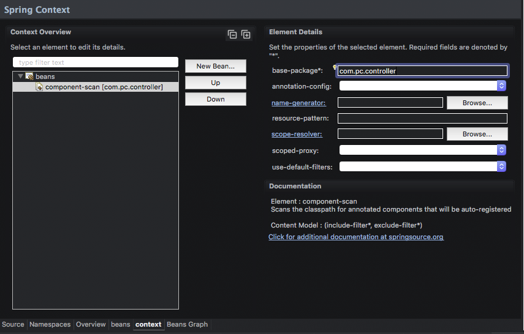

**Archivo**: */WebContent/WEB-INF/dispacher-servlet.xml*
````xml
<context:component-scan base-package="com.pc.controller"></context:component-scan>
````
### CREAR UN CONTROLADOR
1. Click derecho en paquete de controladores > New > Class
2. Anadir al inicio de la clase la anotacion @Controller
3. Anadir un metodo con la anotacion RequestMapping("/url")
````java

// Metodo para enlazar con la vista
@RequestMapping("/")
public String showIndex() {
	return "index";
}
````
### CREACION DE LA VISTA

1. En  la carpeta WEB-INF crear la varpeta views y un jsp con el nombre especificado en el metodo del controlador.


#### [JSTL](https://www.tutorialspoint.com/jsp/jsp_standard_tag_library.htm)
Libreria para introducir codigo java en las vistas

1. Anadir la libreria jstl por maven
	````xml
	<dependency>
		<groupId>jstl</groupId>
		<artifactId>jstl</artifactId>
		<version>1.2</version>
	</dependency>
	````
2.  En las vistas jsp, copiar el codigo
```jsp
<%@ taglib prefix = "c" uri = "http://java.sun.com/jsp/jstl/core" %>
```


  
 